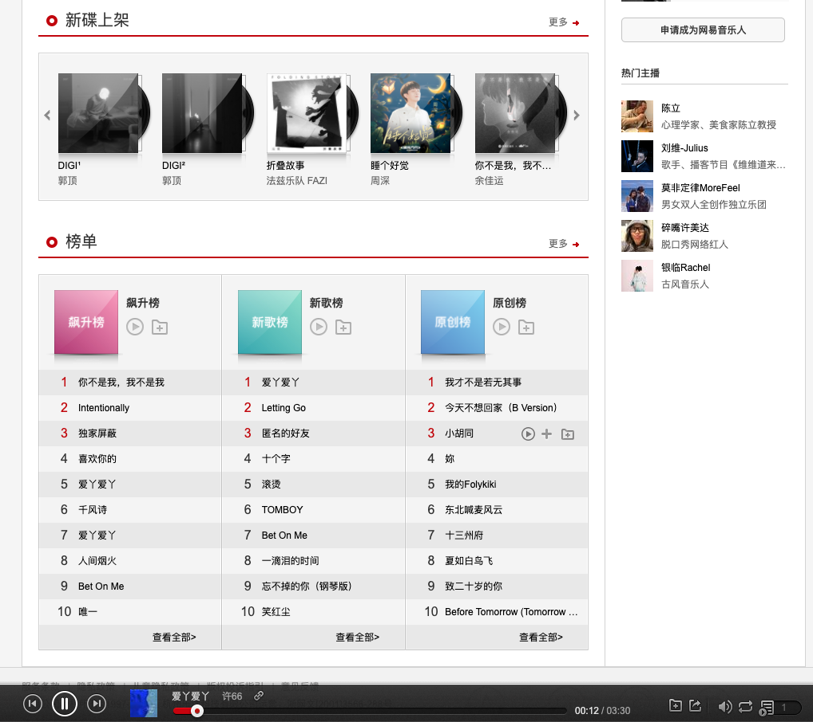
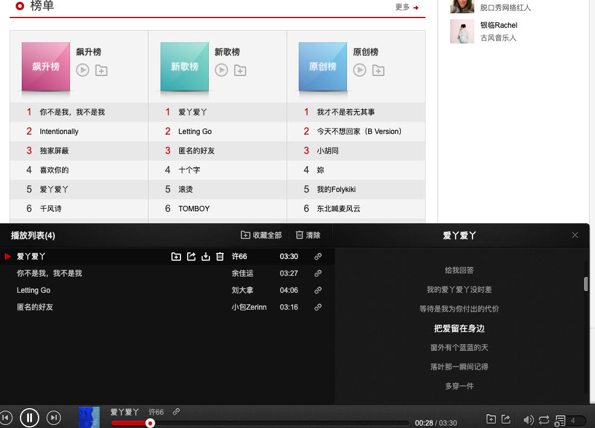
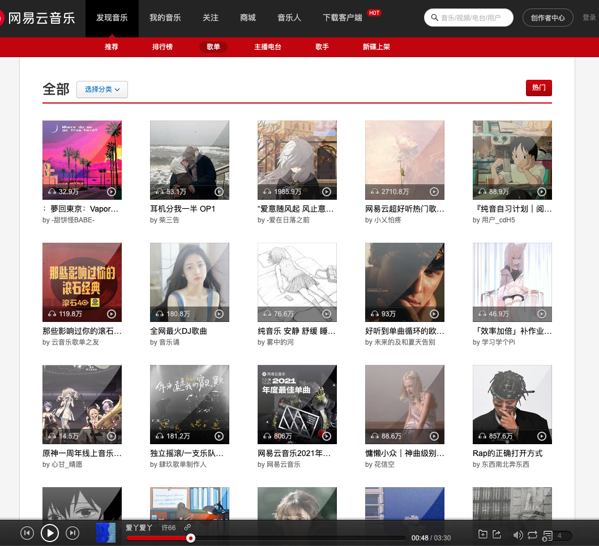
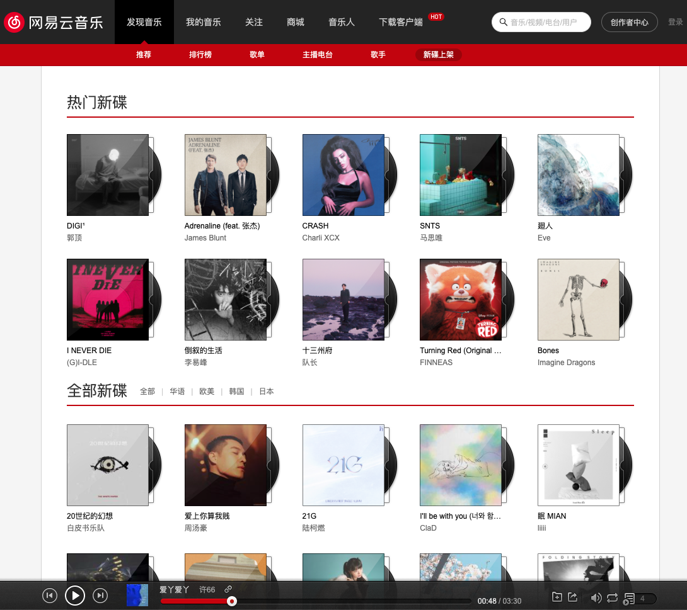
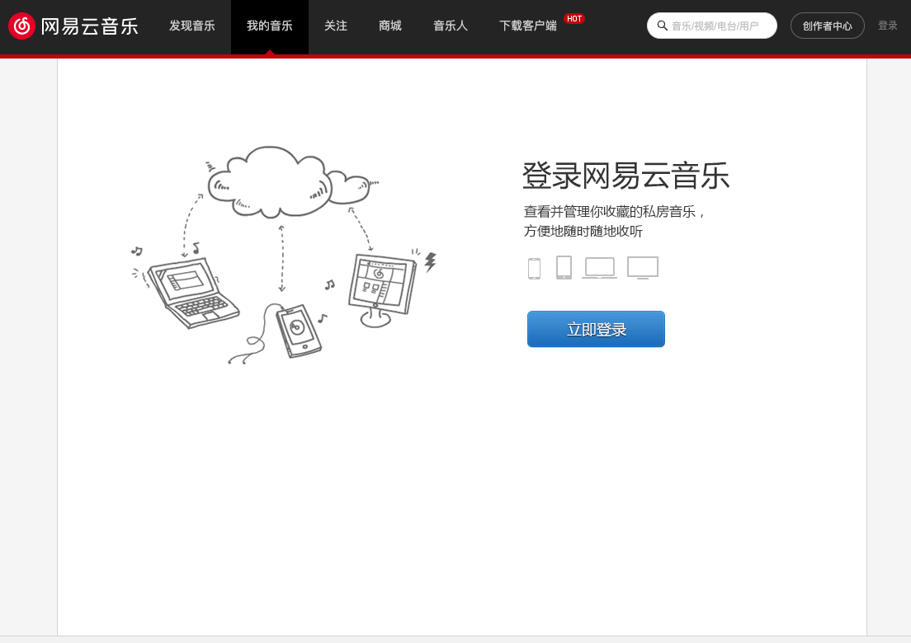

# Quiet

本仓库为[网易云音乐web端](https://music.163.com/#)实现

[项目预览地址](https://duan-music-react.vercel.app/#/discover/recommend) 如果觉得效果还不错的话，欢迎留下你的Star✨，嘻嘻😁

## 技术栈

- react：框架选型
- react-router：路由管理
- redux + [immutable](https://github.com/gajus/redux-immutable#readme) + redux-thunk：状态管理
- antd + [styled-components](https://styled-components.com/)：UI库+样式处理
- axios：网络请求
- webpack：构建工具
- eslint + prettier：代码规范

## 项目接口

> 感谢[Binaryify](https://github.com/Binaryify)对接口文档的不断维护与更新

本项目采用4.2.0版本的接口，已经部署到vercel上，[接口文档地址](https://netease-cloud-music-api-4-2-0.vercel.app/)

## 运行方式

- 克隆仓库 `git clone https://github.com/gaoxiaoduan/duan-music-react.git`

- 进入项目文件夹 `cd duan-music-react`

- 安装依赖 `npm install`

- 运行项目 `npm start`
- 提交代码`npm run commit`

## 功能展示

已完成界面

- [x] 推荐模块
- [x] 歌单模块
- [x] 新碟上架
- [x] 轮播图、歌曲播放、歌词解析滚动

todo:

- [ ] 排行榜
- [ ] 主播电台
- [ ] 播放详情页
- [ ] 用户登录
- [ ] ...

## 效果展示

|  |  |
| ---- | ------------------------------------------------------------ |
|  |  |
|  |  |
|  |  |

## 最后

欢迎大家提issue，pr

本项目仅供学习交流使用，切勿用于商业用途，如有侵犯第三方版权问题及时联系我
